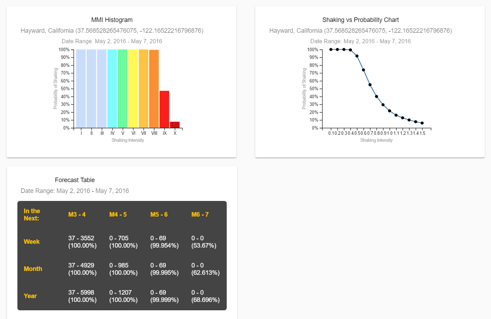
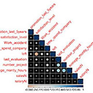
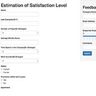

## Skills

API Documentation
Java/JavaScript/HTML/CSS
Angular 4/NodeJS/MongoDB
Data Analytics/Machine Learning
Cloud Computing
Cyber Security 
PMP Certified *1943876
Agile/Scrum

## Projects 

> 
**Earthquake Forecast Map Website for USGS**   
  
* Designed and developed a hazard map website for USGS to show aftershock forecast of earthquakes.
* Key Features: heatmap (showing harzard probabilities), search region, date and severity selection, pin a region, probability line chart and histgram, step-by-step tutorial, API to fetech data. 
* Technology: Built the website With Angular 2 (and 4) and TypeScript, the interactive map with Leaflet, the report charts with D3, and created data server with Rest API in JSON format.
* Github links: Hazard map [repo](https://github.com/echolinr/USGS-Earthquake-Forecast-Map), Server API [repo](https://github.com/echolinr/USGS-MAP-API). 
---
**Ride Share API**  
    
* Developed an Uber-like application with interactive drivers and passengers.
* Key Features: CRUD (drive, car, passenger and ride), authentication, versioning, encryption/hashing data, session API, unit testing and scale testing.
* Technology: Java, JavaScript, Spark, Jackson, MongoDB, MongoLink, Restful API.
* Github link: [repo](https://github.com/echolinr/Ride-Share-API).
---
**Data Analytics App for Employee's Satisfaction Level**  
   
* This is an application to predict an employee's satisfaction level using Random Forest Tree method.
* As data analyst, I collected data, found and validate the optimal model to predict outcome.
* Technology: RStudio, RShiny, Programming R.
* Github link: [repo](https://github.com/echolinr/shinyapp-hr-satisfaction).
---
**Document System and Portal for Hillstone Security Products**  
 
* Hands-on, documented and tested various cybersecurity products, including Next Generation Firewalls, Data Center Firewalls, Cloud Security solutions, Web Application Firewalls (WAF) and IPS.
* Wrote techinical materials of functions like policy, routing, authentication, IPS, HA, VPN, AV, Sandbox, QoS, cloud cyber security. 
* My work includes install guide, user guide, web help, quick start, tutorials, release notes, specification, use case, and more.

## Writing Samples

Here are some examples of my writing work.
> 
**USGS Earthquake Forecast Deployment and API Documentation**  
* An earthquake aftershock forecast web application using USGS forecast model.
* Writing sample [link](projects/project_a.md).
---
**NG Firewall Deployment Guide**  
* This section introduces basic data flow of a firewall device and its typical deployment modes.   
* Use the [link](http://docs.hillstonenet.com/en/Content/3_Deploy_Your_Device/deploy_your_device.htm) to see the writing sample.
---
**Dummy's Guide to Network Security**  
* A scenario-based cookbook which contains a set of recipes of configuration instructions for StoneOS devices.
* Use this [link](http://docs.hillstonenet.com/en/Content/Cookbook/intro.htm) to see the book.
---
**Cloud Security Firewall Guide** 
* First creator and owner of technical documents and training content of Hillstone cloud firewall software running on AWS, Aliyun,VMWare ESXi, KVM and OpenStack. 
* Install Guide download link: [PDF](http://kb.hillstonenet.com/en/wp-content/uploads/2016/11/CloudEdge-Deployment-Guide-2.pdf).

# Technology  

> 
* **Language**: Java, JavaScript, SWIFT, HTML, CSS, XML, MarkDown, Angular, RESTful API, Node JS, MongoDB.
* **Certificates**: PMP  (Project Management Professional) **#1943876**
* **Tools**: Jekyll, DITA, Madcap Flare, RoboHelp, WebStorm, MS Office, Camtasia, InDesign, Illustrator, Visio.
* **Network & Security**： Next Generation Firewall(NGFW), Intrution Prevention System(IPS), Web Application Firewall(WAF), Cloud Security, Malware Detection, Routing & Switching

# Education 

> 
| MS in Software Engineering and Management 	|  |  | 
|:---|---:|---:| 
| Carnegie Mellon University |	Aug 2016 - Aug 2017 |  Mountain View, CA  |  
* **GPA**: 3.96 	  
* **Courses**: Project Management, Product Design, Architectural Programming Principles, Data Analytics, Cloud Computing, IoT     
* **Projects**: USGS Earthquake Forecast Map Application (as web developer), Ride Share API (as developer). 

# Experience

> 
|Graduate Research Assistant  |  |  |
|:---|---:|---:| 
| Carnegie Mellon University |  Jan 2017 - May 2017  | Mountain View, CA |
* Design and develop USGS earthquake aftershock forecast web application using Java, Angular 2, Node JS, and MongoDB. 
* Use Leaflet library to create interactive map web application. 
* Use D3 library to generate earthquake animated shake histogram and line chart.  
---
| Sr. Manager of Technical Documentation  |  | Industry: Cyber Security |
|:---|---:|---:| 
|Hillstone Networks Inc.  |  Aug 2014 - Aug 2016  | Sunnyvale, CA  |
* **Leadership and adaptiveness**: Managed a team of five tech writers to develop the documentation system for all company products; cared about employees career development growth; adjusted their work focus and provided different training opportunities based on their preference of future plan.
* **Proactive and able**: Innovated and built the first and only document [portal](http://docs.hillstonenet.com/en/Content/Home.htm) which serves thousands of customers in learning the company’s products; moved team from PDF-only deliverables to HTML + PDF with Madcap Flare. 
* **Technology and mindset innovator**: Introduced a new authoring tool and trained the team with a new writing methodology, which improved our efficiency by 30% in terms of document quantity, reusability and file format. 
* **Teamwork and ownership**: Reviewed UI elements for all products and made changes in workflow, wording, consistency and design.
---
|Business Analyst & Scrum Master |  | Industry: CRM | 
|:---|---:|---:| 	     		  					   
| Avanade (owned by Accenture) 			|   2012 - 2014		 	 		|		  Beijing, China	|
* As the business analyst (BA), gathered and analyzed user requirements from customers to build the customized Microsoft Dynamic CRM system for the largest China bank.
* As the scrum master (SM), reviewed sprint plans, maintained project scope, estimated and scheduled resources for agile development processes, and ensured the completion of each sprint.
---
|Sr. Technical Writer & Interpreter|   |   | 
|:---|---:|---:| 
| Hillstone Networks Inc. 			|   2008 - 2012		 	 		|		  Beijing, China	|           		    		

# Hobbies

> 
* A marathon runner, 10+ full marathons including Berlin, Tokyo, Seattle and Chicago.
* A certified lifeguard with CPR, first aid and AED certification.
* Trekked several holy mountains in Tibet (Amne Machin, Mount Kailash, etc).
* A social worker at animal welfare NGO for more than ten years.
* I love traveling and have been to 15+ countries.